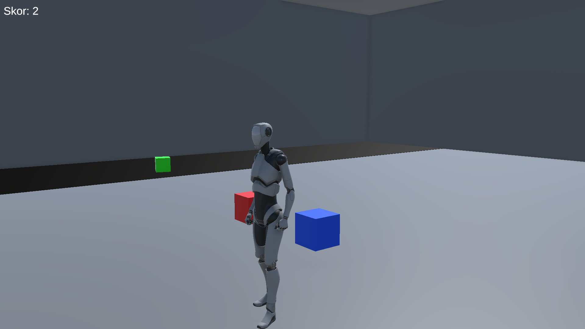

# Küp Toplama Oyunu 

Bu Unity mini oyun projesinde, oyuncu farklı renkteki küpleri toplayarak puan kazanır. Temel karakter kontrolü, obje etkileşimi, skor sistemi ve UI yönetimi gibi özellikleri içerir.

## Özellikler
- Starter Assets ile karakter kontrolü
- "E" tuşu ile obje alma ve bırakma
- Skor alanına bırakılan küplerden puan kazanma
- UI üzerinden anlık skor takibi
- Her küp farklı puan değeri taşır

## Kullanılan Teknolojiler
- Unity 2022.3
- C#
- TextMeshPro UI
- Trigger Collider sistemi

## Görseller

## Kurulum
1. Bu projeyi klonlayın veya indirin
2. Unity 2022.3 ile açın
3. `MainMenu` sahnesini çalıştırın
4. `Start` butonuna basın

## Katkı
Bu proje, Unity temel sistemlerini öğrenmek ve portföy oluşturmak amacıyla yapılmıştır.
